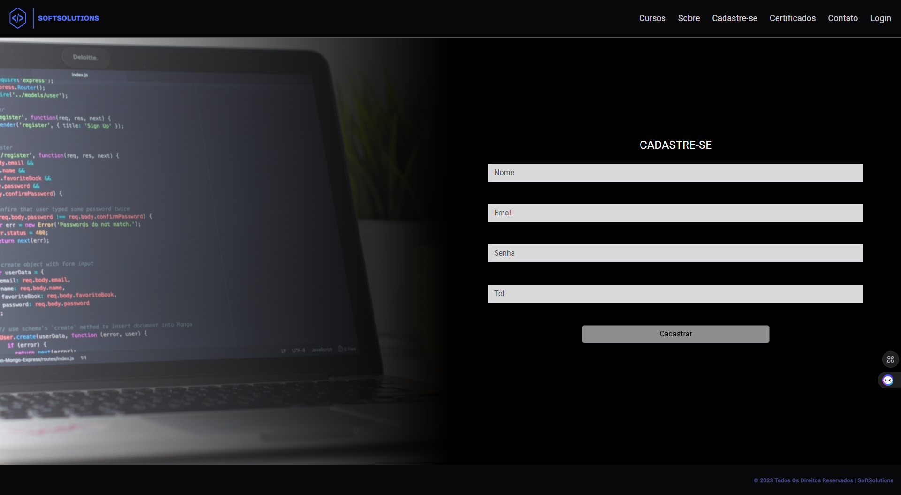
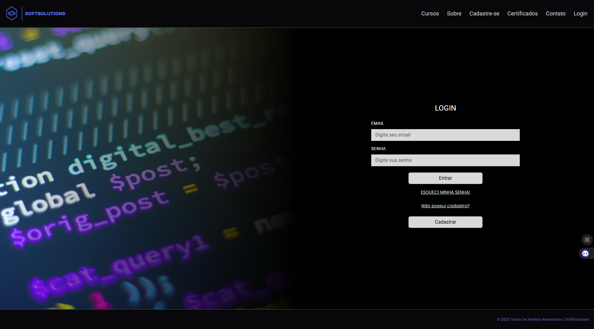

<h1 align="center">Sprint 1: 01/08/2024 a 31/08/2024</h1>

    <a href="#objetivos">Objetivos da sprint</a> &nbsp |&nbsp &nbsp
    <a href="#entregas">Entregas</a> &nbsp |&nbsp &nbsp
    <a href="#links">Links úteis</a>

O projeto se baseia no desenvolvimento de uma plataforma de cursos online denominado SoftSolutions, sendo necessário que os visitantes naveguem pelas páginas do site sem dificuldades, bem como os futuros usuários realizem seu cadastro na plataforma para que possam acessar as demais funcionnalidades, como o acesso aos cursos oferecidos, abrir chamados com o suporte etc. Tendo em mente o emprego de uma metodologia ágil para o desenvolvimento de software, a primeira Sprint dedicou-se em implementar a criação do cadastro de usuários, realização de login, navegação pelo site (em especial a conclusão da aba "Quem somos"), inscrever o usuário em um curso e a posterior visualização do curso já inscrito. Para isso, foram levantados e validados os requisitos e o protótipo, construindo os serviços e interfaces visando uma entrega de grande valor condizente com as necessidades do cliente.

    
## 🎯 Objetivos da Sprint
Os requisitos (tanto do cliente como da instituição de ensino) abrangidos por essa sprint são:
- **RF 0001:** Permitir que os usuários se cadastrem na plataforma
- **RF 0003:** Garantir a matrícula do usuário no curso desejado
- **RF 0009:** Exibir ao usuário um breve resumo sobre a história e valores da empresa
- **RNF 0001:** Garantir que a plataforma seja rápida e responsiva
- **RNF 0003:** Criar uma interface intuitiva e fácil de usar

        
## ✅ Entregas
Para entregas da sprint, tivemos os artefatos SCRUM validados, como Backlog do Produto, Backlog das Sprints e User Stories, através de comunicação direta entre o P.O. e o cliente. 

Para extrair e entender os desejos do cliente, foi construído um protótipo inicial no Figma, criando a identidade visual e design do sistema e apresentando para validação com o cliente. Posteriormente, iniciou-se a estruturação do site através do framework Angular e início da implementação de suas funcionalidades em Type Script, conforme observado a seguir:

### Página "Quem Somos"

### Página "Cadastre-se"

### Página "Login"

→ [Voltar ao topo](#topo)

As tarefas de maior complexidade como a validação da inscrição de um usuário em determinado curso seguem em andamento. De outra forma, o presente protótipo valida a entrega dos requisitos de menor complexidade para a presente sprint, onde suas descrições podem ser checadas a seguir:

### RF 0001: Criar Cadastro

Este requisito se trata do cadastro do usuário na plataforma, o que permitirá que o mesmo tenha acesso as demais funcionalidades, que vão além da simples navegação. Este requisito foi desenvolvido na primeira sprint levando em consideração as principais funções para a utilidade geral do projeto, e passará por refinamento e testes ao final das entregas.

### RF 0009: Página "Quem Somos" e demais aspectos visuais do site

Este requisito se trata das informações presentes na aba "Quem somos", com a descrição dos objetivos e valores da empresa. Da mesma forma, o cumprimento do presente abrange aspectos relacionados ao layout e acessibilidade do site. 
    
→ [Voltar ao topo](#topo)

    

    
> 🔗 **Links gerais**  
> - Documentação do software: [clique aqui para acessar](https://github.com/SoftSolutionsProject/SoftSolutions/tree/0932283a29cb3ae6b0b7052d5e507ce448fa0b1d/DOCUMENTACAO)
> - Sobre o projeto: [clique aqui para acessar](https://github.com/SoftSolutionsProject/SoftSolutions/blob/0932283a29cb3ae6b0b7052d5e507ce448fa0b1d/readme.md)
> - Links para os repositórios criados:
>    - **Frontend:** [clique aqui para acessar](https://github.com/SoftSolutionsProject/SoftSolutions/tree/0932283a29cb3ae6b0b7052d5e507ce448fa0b1d/frontend)
>    - **Microsserviços (backend):** [clique aqui para acessar](https://github.com/SoftSolutionsProject/SoftSolutions/tree/0932283a29cb3ae6b0b7052d5e507ce448fa0b1d/backend)
>    - **Backlog (JIRA):** [clique aqui para acessar](https://notaro.atlassian.net/jira/software/projects/SCRUM/boards/1/backlog?epics=visible)

→ [Voltar ao topo](#topo)
