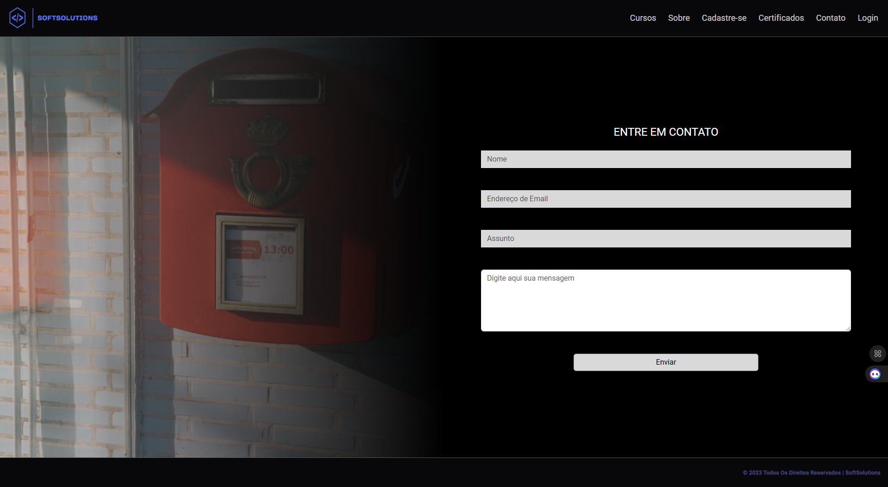

<h1 align="center">Sprint 2: 01/09/2024 a 30/09/2024</h1>

    <a href="#objetivos">Objetivos da sprint</a> &nbsp |&nbsp &nbsp
    <a href="#entregas">Entregas</a> &nbsp |&nbsp &nbsp
    <a href="#links">Links úteis</a>

Nesta segunda Sprint a equipe se voltou a atender os requisitos previstos para uma nova etapa de desenvolvimento do site, dedicando-se em dar início a implementação da funcionalidade de gerenciamento de cursos e a abertura de chamados através da aba "Contato".  

    
## 🎯 Objetivos da Sprint
Os requisitos (tanto do cliente como da instituição de ensino) abrangidos por essa sprint são:
- **RF 0006:** Incluir, alterar e excluir curso do banco de dados
- **RF 0010:** Disponibilizar canal de suporte ao cliente para a resolução de problemas
- **RNF 0005:** Garantir a escalabilidade da plataforma com a inclusão de novos cursos

        
## ✅ Entregas
Ambas as tarefas descritas na presente Sprint, devido a maior complexidade, encontram-se em fase de desenvolvimento, necessitando de testes mais efetivos até a entrega final.

 As funcionalidades relacionadas a inclusão/exclusão de cursos bem como o seu registro em banco de dados fez uso da linguagem Type Script e ferramenta MongoDb.

### Página "Contato"

→ [Voltar ao topo](#topo)

### RF 0006: Gerenciar Curso

Este requisito se trata do processo pelo qual o administrador realizada a inclusão de novos cursos e atualização dos cursos existentes na plataforma, bem como efetuar a exclusão quando necessário. . Da mesma forma, o cumprimento do presente abrange aspectos relacionados a escalabilidade do sistema através da inclusão de novos cursos.  

### RF 0010: Contato

Este requisito trata da disponibilização aos clientes de um canal de suporte para a resolução de problemas, desde dificuldades encontradas no site, dúvidas a respeito do conteúdo das aulas, sugestões etc. 
    
→ [Voltar ao topo](#topo)

    

    
> 🔗 **Links gerais**  
> - Documentação do software: [clique aqui para acessar](https://github.com/SoftSolutionsProject/SoftSolutions/tree/0932283a29cb3ae6b0b7052d5e507ce448fa0b1d/DOCUMENTACAO)
> - Sobre o projeto: [clique aqui para acessar](https://github.com/SoftSolutionsProject/SoftSolutions/blob/0932283a29cb3ae6b0b7052d5e507ce448fa0b1d/readme.md)
> - Links para os repositórios criados:
>    - **Frontend:** [clique aqui para acessar](https://github.com/SoftSolutionsProject/SoftSolutions/tree/0932283a29cb3ae6b0b7052d5e507ce448fa0b1d/frontend)
>    - **Microsserviços (backend):** [clique aqui para acessar](https://github.com/SoftSolutionsProject/SoftSolutions/tree/0932283a29cb3ae6b0b7052d5e507ce448fa0b1d/backend)
>    - **Backlog (JIRA):** [clique aqui para acessar](https://notaro.atlassian.net/jira/software/projects/SCRUM/boards/1/backlog?epics=visible)

→ [Voltar ao topo](#topo)
